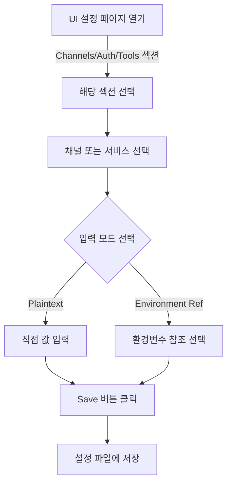

# OpenClaw UI Credential/Secret 관리 탐색

## 개요

OpenClaw UI는 설정/구성 페이지를 통해 다양한 종류의 credential과 secret을 관리할 수 있습니다. 이 문서는 UI에서 제공되는 credential 관리 기능을 상세히 설명합니다.

---

## 1. UI 설정 페이지의 주요 섹션

### 1.1 Credentials 관련 섹션 (Core 카테고리)

**파일**: `ui/src/ui/views/config.ts`

설정 페이지는 다음과 같은 섹션으로 구성되어 있습니다:

| 섹션       | 라벨               | 설명                                             |
| ---------- | ------------------ | ------------------------------------------------ |
| `auth`     | **Authentication** | API keys와 인증 프로필 관리                      |
| `secrets`  | **Secrets**        | Secret provider 설정                             |
| `models`   | **Models**         | AI 모델 프로바이더 설정                          |
| `channels` | **Channels**       | 메시징 채널 설정 (Slack, Discord 등)             |
| `tools`    | **Tools**          | 도구 설정 (웹 검색 등)                           |
| `gateway`  | **Gateway**        | 게이트웨이 서버 설정 (auth token, password 포함) |

```typescript
// 섹션 카테고리 정의
const SECTION_CATEGORIES: SectionCategory[] = [
  {
    id: "core",
    label: "Core",
    sections: [
      { key: "auth", label: "Authentication" },
      { key: "secrets", label: "Secrets" },
      // ... 다른 섹션
    ],
  },
  // ... 추가 카테고리
];
```

### 1.2 SECTION_META - 섹션 설명

**파일**: `ui/src/ui/views/config-form.render.ts`

각 섹션의 메타데이터:

```typescript
export const SECTION_META: Record<string, { label: string; description: string }> = {
  auth: {
    label: "Authentication",
    description: "API keys and authentication profiles",
  },
  secrets: {
    label: "Secrets",
    description: "Secret provider configuration",
  },
  models: {
    label: "Models",
    description: "AI model configurations and providers",
  },
  channels: {
    label: "Channels",
    description: "Messaging channels (Telegram, Discord, Slack, etc.)",
  },
  tools: {
    label: "Tools",
    description: "Tool configurations (browser, search, etc.)",
  },
  // ... 등등
};
```

---

## 2. 지원되는 Credential 타입

### 2.1 인증 프로필 (Auth Profiles)

**파일**: `src/secrets/target-registry-data.ts`

#### API Key 타입

```json
{
  "auth": {
    "profiles": {
      "custom-provider": {
        "provider": "custom-provider",
        "mode": "api_key",
        "key": "your-api-key-here"
      }
    }
  }
}
```

**Secret Ref 지원**:

```json
{
  "auth": {
    "profiles": {
      "provider": {
        "key": "actual-key",
        "keyRef": { "source": "env", "id": "PROVIDER_API_KEY" }
      }
    }
  }
}
```

#### Token 타입

```json
{
  "auth": {
    "profiles": {
      "provider": {
        "provider": "provider-name",
        "mode": "token",
        "token": "access-token"
      }
    }
  }
}
```

---

## 3. 채널별 Credential 요구사항

### 3.1 메시징 채널 Credentials

**파일**: `src/secrets/target-registry-data.ts`

#### Slack

```json
{
  "channels": {
    "slack": {
      "botToken": "xoxb-...",
      "appToken": "xapp-...",
      "signingSecret": "...",
      "userToken": "xoxp-..."
    },
    "slack": {
      "accounts": {
        "workspace-1": {
          "botToken": "xoxb-...",
          "appToken": "xapp-...",
          "signingSecret": "...",
          "userToken": "xoxp-..."
        }
      }
    }
  }
}
```

#### Discord

```json
{
  "channels": {
    "discord": {
      "token": "bot-token",
      "accounts": {
        "account-1": {
          "token": "bot-token"
        }
      }
    }
  }
}
```

#### Telegram

```json
{
  "channels": {
    "telegram": {
      "accounts": {
        "account-1": {
          "botToken": "123456:ABC-DEF..."
        }
      }
    }
  }
}
```

#### Matrix

```json
{
  "channels": {
    "matrix": {
      "accessToken": "syt_...",
      "password": "password",
      "accounts": {
        "account-1": {
          "accessToken": "syt_...",
          "password": "password"
        }
      }
    }
  }
}
```

#### Google Chat

```json
{
  "channels": {
    "googlechat": {
      "serviceAccount": "{\"type\":\"service_account\",...}",
      "serviceAccountRef": { "source": "env", "id": "GOOGLE_SERVICE_ACCOUNT" },
      "accounts": {
        "account-1": {
          "serviceAccount": "json-content-or-path"
        }
      }
    }
  }
}
```

#### Feishu (飞书)

```json
{
  "channels": {
    "feishu": {
      "appSecret": "...",
      "encryptKey": "...",
      "verificationToken": "...",
      "accounts": {
        "account-1": {
          "appSecret": "...",
          "encryptKey": "...",
          "verificationToken": "..."
        }
      }
    }
  }
}
```

#### IRC

```json
{
  "channels": {
    "irc": {
      "password": "...",
      "accounts": {
        "account-1": {
          "password": "...",
          "nickserv": {
            "password": "..."
          }
        }
      }
    }
  }
}
```

#### Mattermost

```json
{
  "channels": {
    "mattermost": {
      "botToken": "...",
      "accounts": {
        "account-1": {
          "botToken": "..."
        }
      }
    }
  }
}
```

#### 기타 채널

- **Blue Bubbles**: `password`
- **MS Teams**: `appPassword`
- **Nextcloud Talk**: `apiPassword`, `botSecret`

---

## 4. Provider/Model Credentials

### 4.1 지원되는 Provider

```json
{
  "models": {
    "providers": {
      "anthropic": {
        "apiKey": "sk-ant-..."
      },
      "openai": {
        "apiKey": "sk-..."
      },
      "google": {
        "apiKey": "..."
      },
      "custom-provider": {
        "apiKey": "..."
      }
    }
  }
}
```

### 4.2 LLM API Keys

- **Anthropic**: `models.providers.anthropic.apiKey`
- **OpenAI**: `models.providers.openai.apiKey`
- **Google**: `models.providers.google.apiKey`
- **기타 프로바이더**: `models.providers.{provider}.apiKey`

---

## 5. Tool 관련 Credentials

### 5.1 웹 검색 도구

```json
{
  "tools": {
    "web": {
      "search": {
        "apiKey": "..."
      },
      "fetch": {
        "firecrawl": {
          "apiKey": "..."
        }
      }
    }
  }
}
```

### 5.2 지원되는 검색 엔진

- **Google**: `tools.web.search.apiKey` / `plugins.entries.google.config.webSearch.apiKey`
- **Brave**: `plugins.entries.brave.config.webSearch.apiKey`
- **Perplexity**: `plugins.entries.perplexity.config.webSearch.apiKey`
- **Tavily**: `plugins.entries.tavily.config.webSearch.apiKey`
- **Firecrawl**: `plugins.entries.firecrawl.config.webSearch.apiKey`
- **Moonshot**: `plugins.entries.moonshot.config.webSearch.apiKey`
- **xAI**: `plugins.entries.xai.config.webSearch.apiKey`

---

## 6. Gateway Authentication

### 6.1 Gateway Auth 설정

```json
{
  "gateway": {
    "auth": {
      "mode": "token | password | trusted-proxy | none",
      "token": "gateway-authentication-token",
      "password": "gateway-password"
    },
    "remote": {
      "token": "remote-auth-token",
      "password": "remote-auth-password"
    }
  }
}
```

**지원되는 Auth 모드**:

- `token`: 토큰 기반 인증
- `password`: 패스워드 기반 인증
- `trusted-proxy`: 신뢰할 수 있는 프록시 인증
- `none`: 인증 없음

---

## 7. UI 컴포넌트 구조

### 7.1 설정 폼 렌더링

**파일**: `ui/src/ui/views/config-form.ts`, `config-form.render.ts`, `config-form.node.ts`

#### 핵심 컴포넌트 함수

```typescript
// 설정 폼 렌더링
export function renderConfigForm(props: ConfigFormProps);

// 개별 노드 렌더링 (필드)
export function renderNode(params: {
  schema: JsonSchema;
  value: unknown;
  path: Array<string | number>;
  hints: ConfigUiHints;
  unsupported: Set<string>;
  disabled: boolean;
  showLabel: boolean;
  onPatch: (path: Array<string | number>, value: unknown) => void;
});
```

### 7.2 Sensitive 데이터 처리

**파일**: `ui/src/ui/views/config-form.node.ts`

sensitive 데이터는 다음과 같이 처리됩니다:

```typescript
type SensitiveRenderState = {
  isSensitive: boolean; // 민감 데이터 여부
  isRedacted: boolean; // 가려짐 상태
  isRevealed: boolean; // 공개됨 상태
  canReveal: boolean; // 공개 가능 여부
};

// 토글 버튼으로 값 표시/숨김 가능
function renderSensitiveToggleButton(params: {
  path: Array<string | number>;
  state: SensitiveRenderState;
  disabled: boolean;
  onToggleSensitivePath?: (path: Array<string | number>) => void;
});
```

민감 데이터 식별:

- `"secret"` 태그 포함 필드
- 경로에 `secret`, `apiKey`, `token`, `password` 등 포함
- UI Hints에서 `sensitive: true` 마킹

### 7.3 SecretRef 객체 지원

**파일**: `ui/src/ui/views/config-form.node.ts`

```typescript
// SecretRef 객체 구조
type SecretRef = {
  source: string; // 예: "env", "vault"
  id: string; // 참조 ID
  provider?: string; // 선택적 프로바이더
};

function isSecretRefObject(value: unknown): value is {
  source: string;
  id: string;
  provider?: string;
};
```

**사용 예시**:

```json
{
  "channels": {
    "slack": {
      "botToken": {
        "source": "env",
        "id": "SLACK_BOT_TOKEN"
      }
    }
  }
}
```

### 7.4 Channel 별 설정 폼

**파일**: `ui/src/ui/views/channels.config.ts`

각 채널의 설정 폼을 동적으로 렌더링:

```typescript
export function renderChannelConfigForm(props: ChannelConfigFormProps);

export function renderChannelConfigSection(params: { channelId: string; props: ChannelsProps });
```

---

## 8. 설정 파일 구조

### 8.1 OpenClaw 메인 설정 (openclaw.json)

```json
{
  "auth": {
    "profiles": {
      "profile-name": {
        "provider": "provider-id",
        "mode": "api_key | token",
        "key": "...",
        "keyRef": { "source": "env", "id": "VAR_NAME" }
      }
    }
  },
  "channels": {
    "slack": { "botToken": "..." },
    "discord": { "token": "..." },
    "telegram": { "accounts": { "account-id": { "botToken": "..." } } }
  },
  "models": {
    "providers": {
      "anthropic": { "apiKey": "..." },
      "openai": { "apiKey": "..." }
    }
  },
  "tools": {
    "web": {
      "search": { "apiKey": "..." },
      "fetch": { "firecrawl": { "apiKey": "..." } }
    }
  },
  "gateway": {
    "auth": {
      "mode": "token",
      "token": "...",
      "password": "..."
    }
  }
}
```

### 8.2 인증 프로필 별도 저장소 (auth-profiles.json)

```json
{
  "profiles": {
    "provider-name": {
      "provider": "provider-id",
      "mode": "api_key | token | oauth",
      "key": "api-key-value",
      "keyRef": { "source": "env", "id": "VAR_NAME" },
      "token": "token-value",
      "tokenRef": { "source": "env", "id": "VAR_NAME" }
    }
  }
}
```

---

## 9. Secret 입력 모드 (Secret Input Mode)

**파일**: `src/plugins/provider-auth-mode.ts`

사용자가 credential을 입력할 때 선택할 수 있는 모드:

```typescript
type SecretInputMode = "plaintext" | "env_ref";

// Plaintext: 직접 입력
// Env Ref: 환경변수 참조
```

---

## 10. Credential 매트릭스 (Secret Target Registry)

**파일**: `src/secrets/target-registry-data.ts`

모든 지원되는 credential의 중앙 레지스트리:

```typescript
const SECRET_TARGET_REGISTRY: SecretTargetRegistryEntry[] = [
  {
    id: "auth-profiles.api_key.key",
    targetType: "auth-profiles.api_key.key",
    configFile: "auth-profiles.json",
    pathPattern: "profiles.*.key",
    refPathPattern: "profiles.*.keyRef",
    secretShape: "sibling_ref",
    expectedResolvedValue: "string",
    includeInPlan: true,
    includeInConfigure: true,
    includeInAudit: true,
    authProfileType: "api_key",
  },
  // ... 수백 개의 다른 credential 항목
];
```

---

## 11. 사용자 인터페이스 흐름

### 11.1 Credential 등록 일반 흐름



### 11.2 Sensitive 데이터 표시

```
┌─────────────────────────────────────────┐
│ Bot Token: ●●●●●●●●● [👁️]            │
│ (마우스 호버 또는 클릭으로 표시)         │
└─────────────────────────────────────────┘
```

---

## 12. 검색 및 필터링

**파일**: `ui/src/ui/views/config-form.node.ts`

설정 검색 기능:

```typescript
// 텍스트 검색 및 태그 필터
export function parseConfigSearchQuery(query: string): ConfigSearchCriteria {
  return {
    text: "검색 텍스트",
    tags: ["secret", "auth"], // tag:secret tag:auth
  };
}
```

**사용 예시**:

- `"slack"` → Slack 관련 설정 검색
- `"tag:secret"` → secret 태그가 있는 설정만 필터
- `"api tag:security"` → "api" 포함 + security 태그 필터

---

## 13. 지원 파일 위치

| 기능                  | 파일 경로                               |
| --------------------- | --------------------------------------- |
| UI 설정 페이지        | `ui/src/ui/views/config.ts`             |
| 폼 렌더링             | `ui/src/ui/views/config-form.render.ts` |
| 노드 렌더링           | `ui/src/ui/views/config-form.node.ts`   |
| 채널 설정             | `ui/src/ui/views/channels.config.ts`    |
| Credential 레지스트리 | `src/secrets/target-registry-data.ts`   |
| 타입 정의             | `src/secrets/target-registry-types.ts`  |
| 검색/쿼리             | `src/secrets/target-registry-query.ts`  |
| Provider Auth         | `src/plugins/provider-auth-helpers.ts`  |
| 로케일 (다국어)       | `ui/src/i18n/locales/en.ts`             |

---

## 14. 주요 기능 요약

✅ **지원되는 기능**:

- 다양한 채널의 credential 관리 (Slack, Discord, Telegram 등)
- LLM API key 관리 (Anthropic, OpenAI, Google 등)
- 환경변수 참조 (`SecretRef`)
- Sensitive 데이터 표시/숨김
- 인증 프로필 생성 및 관리
- Gateway 인증 설정 (token, password)
- 웹 검색 도구 API key
- 설정 검색 및 필터링
- 다국어 지원

🎯 **주요 특징**:

- 중앙 집중식 credential 레지스트리
- 보안을 고려한 민감 데이터 표시
- 유연한 secret 저장소 지원 (env ref, inline)
- 폼 기반 직관적 UI

---

## 15. 관련 문서

- [Auth Credential Semantics](docs/auth-credential-semantics.md)
- [Plugin SDK Provider Auth](src/plugin-sdk/provider-auth.ts)
- [Config Types](src/config/types.openclaw.ts)
- [웹 대시보드 인증](ui/src/ui/views/overview.ts)
